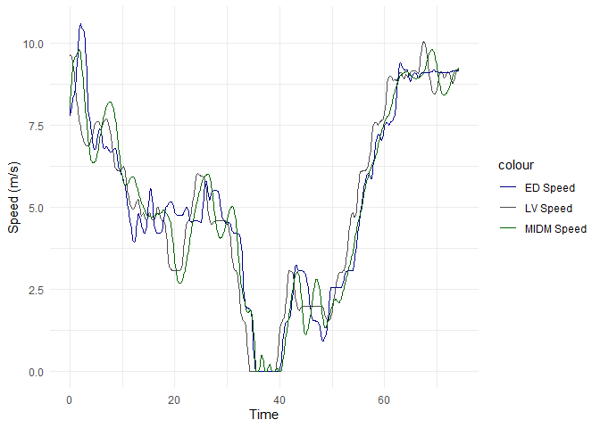
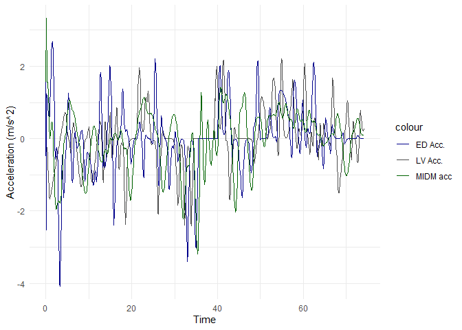
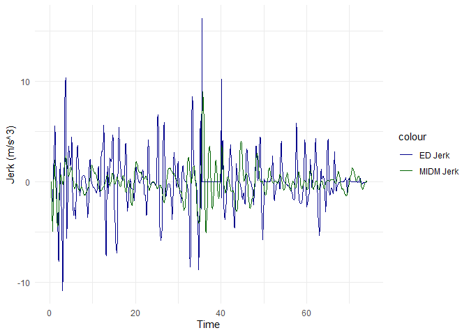

<!-- README.md is generated from README.Rmd. Please edit that file -->

### Code for A new car-following model with incorporation of Markkula’s framework of sensorimotor control in sustained motion tasks

This code repository contains functions to use the
`Markkula Intelligent Driver Model (MIDM)` developed in the [paper
titled
above](https://www.sciencedirect.com/science/article/abs/pii/S0191261524000936).
There are two code files in the `code` folder:

- `DoControlModelTimeStep_new.R`: This is essentially the same
  functionality in R as written by Gustav Markkula in MATLAB. The
  function `DoControlModelTimeStep_new` estimates the intermittent
  control in a simulation.  
- `simulate_full_IDM_intermittent_new.R`: This uses the
  `DoControlModelTimeStep_new` in a car-following model for predicting
  speed, acceleration, jerk, and spacing of a following vehicle.

#### Example

Load the example data:

``` r
dat <- read.csv("data/demo_trajectory_data.csv")
head(dat)
#>   X Time ED_vehicle_id LV_vehicle_id Lane ED_speed_mps LV_speed_mps
#> 1 1  0.0          2117          2106    5      8.04759      9.62645
#> 2 2  0.1          2117          2106    5      7.79538      9.61614
#> 3 3  0.2          2117          2106    5      7.91884      9.59974
#> 4 4  0.3          2117          2106    5      8.03850      9.57237
#> 5 5  0.4          2117          2106    5      8.14564      9.52746
#> 6 6  0.5          2117          2106    5      8.23359      9.45645
#>   ED_acc_mps2_lag LV_acc_mps2_lag ED_position_m_new LV_position_m_new
#> 1         1.55465        -0.08244          50.28434          70.30226
#> 2        -2.52212        -0.10316          51.06388          71.26387
#> 3         1.23465        -0.16401          51.85576          72.22384
#> 4         1.19660        -0.27361          52.65961          73.18108
#> 5         1.07138        -0.44917          53.47417          74.13383
#> 6         0.87947        -0.71005          54.29753          75.07947
#>   LV_width_m LV_length_m LV_spacing_m LV_frspacing_m ED_jerk_mps3_lag
#> 1          2      5.1212     20.01792       14.89672               NA
#> 2          2      5.1212     20.19999       15.07879         -40.7677
#> 3          2      5.1212     20.36808       15.24688          37.5677
#> 4          2      5.1212     20.52147       15.40027          -0.3805
#> 5          2      5.1212     20.65966       15.53846          -1.2522
#> 6          2      5.1212     20.78194       15.66074          -1.9191
```

Other than vehicle IDs and lane number, all variables are needed as
inputs to the MIDM. Lead vehicle and following vehicle variables use the
prefixes `LV` and `ED` respectively.

MIDM requires the complete trajectory of the lead vehicle and only the
first values of the following vehicle variables. But the function
`simulate_full_IDM_intermittent_new` asks for a dataframe with both `LV`
and `ED` variables to later compare the observed trajectories with the
MIDM trajectories.

In this example, we use the following arguments for the model
parameters:

``` r
model_arguments <- c(
  Tg = 1.368, A = 3.325, b = 4.189, v_0 = 28, small_delta = 5.816,
  s_0 = 1.825, accumulator_gain = 3022.003, A_plus = 25.055, A_minus = -24.579,
  lambda = 0.744, epsilon_0 = 2.404, tau_s = 0.026, tau_m = 0.029,
  sigma_n = 0.395, sigma_m = 0.291, G_Duration = 0.666, G_StdDev = 0.373,
  H_Time_error_starts_disappearing = 0.367, H_Time_error_disappeared = 1.524,
  H_error_pred_sd_to_include = 1.92
)
```

Now we can use the MIDM to generate trajectories:

``` r
results <- simulate_full_IDM_intermittent_new(
  dat,
  model_arguments[1], 
  model_arguments[2], 
  model_arguments[3], 
  model_arguments[4], 
  model_arguments[5], 
  model_arguments[6], 
  1,
  model_arguments[7], 
  model_arguments[8], 
  model_arguments[9], 
  model_arguments[10], 
  model_arguments[11], 
  model_arguments[12],   
  model_arguments[13], 
  model_arguments[14], 
  model_arguments[15], 
  model_arguments[16], 
  model_arguments[17], 
  model_arguments[18],
  model_arguments[19],
  model_arguments[20]
)

head(results)
#> # A tibble: 6 × 29
#>    Time LV_speed_mps ED_speed_mps ED_pred_speed_mps LV_acc_mps2 ED_acc_mps2
#>   <dbl>        <dbl>        <dbl>             <dbl>       <dbl>       <dbl>
#> 1   0           9.63         8.05              8.05     -0.0824       1.55 
#> 2   0.1         9.62         7.80              8.20     -0.103       -2.52 
#> 3   0.2         9.60         7.92              8.54     -0.164        1.23 
#> 4   0.3         9.57         8.04              8.87     -0.274        1.20 
#> 5   0.4         9.53         8.15              9.02     -0.449        1.07 
#> 6   0.5         9.46         8.23              9.18     -0.710        0.879
#> # ℹ 23 more variables: sn_star_second_part <dbl>, sn_star_third_part <dbl>,
#> #   sn_star <dbl>, bn_second_part <dbl>, bn_third_part <dbl>, bn <dbl>,
#> #   povInverseTau <dbl>, ED_pred_acc_mps2 <dbl>, LV_length_m <dbl>,
#> #   LV_width_m <int>, LV_spacing_m <dbl>, LV_frspacing_m <dbl>,
#> #   LV_pred_frspacing_m <dbl>, ED_jerk_mps3_lag <dbl>, ED_pred_jerk_mps3 <dbl>,
#> #   VP <dbl>, VP_p <dbl>, Vepsilon <dbl>, VA <dbl>, VC <dbl>, VCdot <dbl>,
#> #   SControlModelStates <list>, SControlModelParameters <list>
```

The new variables in the `results` are:

- `ED_pred_speed_mps`: Following vehicle speed predicted by MIDM  
- `ED_pred_acc_mps2`: Following vehicle acceleration predicted by MIDM  
- `LV_pred_frspacing_m`: Spacing (front bumper to rear bumper) predicted
  by MIDM  
- `ED_pred_jerk_mps3`: Following vehicle jerk predicted by MIDM

… and others.

We can now compare the results with oberved data:

``` r
library(ggplot2)

ggplot(data = results, aes(x = Time)) +
  geom_line(aes(y = LV_speed_mps, color = "LV Speed")) +
  geom_line(aes(y = ED_speed_mps, color = "ED Speed")) +
  geom_line(aes(y = ED_pred_speed_mps, color = "MIDM Speed")) +
  labs(y = "Speed (m/s)") +
  scale_color_manual(values = c("darkblue", "grey30", "darkgreen")) +
  theme_minimal() 
```

<!-- -->

``` r

ggplot(data = results, aes(x = Time)) +
  geom_line(aes(y = LV_acc_mps2, color = "LV Acc.")) +
  geom_line(aes(y = ED_acc_mps2, color = "ED Acc.")) +
  geom_line(aes(y = ED_pred_acc_mps2, color = "MIDM acc")) +
  labs(y = "Acceleration (m/s^2)") +
  scale_color_manual(values = c("darkblue", "grey30", "darkgreen")) +
  theme_minimal() 
```

<!-- -->

``` r

ggplot(data = results |> dplyr::filter(Time > 0.2), aes(x = Time)) +
  geom_line(aes(y = ED_jerk_mps3_lag, color = "ED Jerk")) +
  geom_line(aes(y = ED_pred_jerk_mps3, color = "MIDM Jerk")) +
  labs(y = "Jerk (m/s^3)") +
  scale_color_manual(values = c("darkblue", "darkgreen")) +
  theme_minimal() 
```

<!-- -->

### Terms of use

> THE SOFTWARE IS PROVIDED “AS IS”, WITHOUT WARRANTY OF ANY KIND,
> EXPRESS OR IMPLIED, INCLUDING BUT NOT LIMITED TO THE WARRANTIES OF
> MERCHANTABILITY, FITNESS FOR A PARTICULAR PURPOSE AND NONINFRINGEMENT.
> IN NO EVENT SHALL THE AUTHORS OR COPYRIGHT HOLDERS BE LIABLE FOR ANY
> CLAIM, DAMAGES OR OTHER LIABILITY, WHETHER IN AN ACTION OF CONTRACT,
> TORT OR OTHERWISE, ARISING FROM, OUT OF OR IN CONNECTION WITH THE
> SOFTWARE OR THE USE OR OTHER DEALINGS IN THE SOFTWARE.

You are free to use and modify the code in this repository in your own
work only. Reproduction, display, distribution and transmission of the
codes to third parties is forbidden. Please abide by these terms:

- Use the code for academic purposes only.  
- Cite the [Transportation Research Part-B
  paper](https://www.sciencedirect.com/science/article/abs/pii/S0191261524000936)
  when you publish any derivative work based on this code/study.
